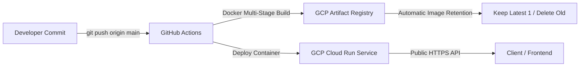

# 🚀 Spring AI Full-Stack Showcase

A modern, production-grade AI integration platform demonstrating the practical application of **Spring AI**, **Spring Boot**, and **React (Vite)**, deployed serverless on **Google Cloud Platform (Cloud Run)** with automated **GitHub Actions CI/CD**.

---

## 👨‍💻 Project Overview & Recruiter Highlights

This repository highlights hands-on expertise in building cloud-native, generative AI-powered services within the Java enterprise ecosystem. Rather than simple API wrappers, the project showcases structured prompt engineering, multimodal integrations (Chat, Image Generation, Audio Transcription), containerization, and enterprise DevOps best practices.

### 💡 Core Competencies & Skills Acquired with Spring AI:
* **OpenAI-Compatible Model Abstraction:** Utilizing `spring-ai-starter-model-openai` configured against third-party AI endpoints (Together AI), proving flexibility across diverse LLM providers without vendor lock-in.
* **Dynamic Model & Parameter Steering:** Tuning inference behavior at runtime using `OpenAiChatOptions` (e.g., dynamically adjusting `temperature`, swapping inference models such as `Qwen/Qwen3.5-9B`).
* **Structured Prompt Engineering:** Implementing `PromptTemplate` for parameterized prompt construction, enforcing output formatting and domain constraints (e.g., ingredients, cuisine type, dietary rules).
* **Multimodal Capabilities:**
  * **Text-to-Image Generation:** Implementing `OpenAiImageModel` and `OpenAiImageOptions` to generate images via Stability AI's Stable Diffusion XL.
  * **Speech-to-Text Transcription:** Handling multipart audio file uploads and integrating `OpenAiAudioTranscriptionModel` with OpenAI Whisper Large v3.
* **Cloud-Native & Production Readiness:**
  * Multi-stage, non-root `Dockerfile` optimized for Java 21 Alpine runtime.
  * Serverless deployment on **GCP Cloud Run** with automated scale-to-zero.
  * Automated **GitHub Actions CI/CD** pipeline deploying on every commit to `main`.
  * Configured **Artifact Registry Cleanup Policies** ensuring only the latest image version is retained to prevent runaway cloud storage costs.

---

> [!NOTE]
> ### ⚠️ Note on AI Model Selection & Output Quirks
> To maintain strict cost efficiency and avoid unnecessary operational expenses during development and demonstration, this project deliberately utilizes **budget-friendly, open-source AI models** (via Together AI) rather than high-cost proprietary models (such as GPT-4o).
>
> As a consequence, outputs (e.g., chat nuances, image fidelity, or recipe styling) may occasionally reflect the creative quirks or limitations of these lightweight models. The architecture and code are completely decoupled from the provider and can be switched to any tier-1 model (GPT-4o, Claude 3.5, Gemini 1.5 Pro) simply by adjusting environment variables.

---

## 🛠️ Tech Stack

* **Backend:** Java 21, Spring Boot 4, Spring AI (`2.0.0-M3`), Maven
* **Frontend:** React 18, Vite, CSS3
* **AI Provider:** Together AI (OpenAI API Compatible)
  * Chat: `openai/gpt-oss-120b`, `Qwen/Qwen3.5-9B`
  * Image: `stabilityai/stable-diffusion-xl-base-1.0`
  * Audio Transcription: `openai/whisper-large-v3`
* **DevOps & Cloud:** Google Cloud Run, Google Artifact Registry, Docker, GitHub Actions CI/CD

---

## 📡 REST API Reference

The backend exposes clean REST endpoints accessible by any frontend client:

| HTTP Method | Endpoint | Query / Body Parameters | Description |
| :--- | :--- | :--- | :--- |
| `GET` | `/ask-ai` | `prompt` (string) | Basic AI chat response using default configured LLM. |
| `GET` | `/ask-ai-options` | `prompt` (string) | Chat query executed with custom parameters (Qwen model, temperature: 0.4). |
| `GET` | `/create-recipe` | `ingredients` (string) `cuisine` (optional) `dietaryRestrictions` (optional) | Generates customized recipes based on provided dietary constraints using `PromptTemplate`. |
| `GET` | `/generate-image` | `prompt` (string) `quality` (default: `hd`) `n` (count, default: `1`) `height` (default: `1024`) `width` (default: `1024`) | Generates images via Stable Diffusion XL and returns public image URLs. |
| `POST` | `/ai-transcribe-audio` | `file` (`MultipartFile` - `.wav`, `.mp3`) | Transcribes uploaded audio file into plain text using Whisper Large. |

---

## ⚙️ Configuration & Environment Variables

The backend application requires the following environment variables:

| Variable | Description | Default (Local) |
| :--- | :--- | :--- |
| `TOGETHER_AI_API_KEY` | API Key for Together AI / OpenAI provider | *(Required)* |
| `PORT` | Port for the embedded web server (Cloud Run standard) | `8080` |
| `FRONTEND_URL` | Allowed CORS origins (comma-separated, trailing slashes trimmed) | `http://localhost:5173` |

---

## 🚢 CI/CD & Deployment Workflow

1. Any push to `main` touching `spring-ai/**` triggers [`.github/workflows/deploy-backend.yml`](.github/workflows/deploy-backend.yml).
2. The workflow builds the Java 21 container image and tags it with `${{ github.sha }}` and `latest`.
3. Pushes image to Artifact Registry in region `europe-west3`.
4. Deploys service to Cloud Run with public access (`--allow-unauthenticated`) and minimal resource allocation (`1 vCPU`, `1GB RAM`).
5. Artifact Registry cleanup policy automatically cleans up previous container layers, keeping storage costs at $0.